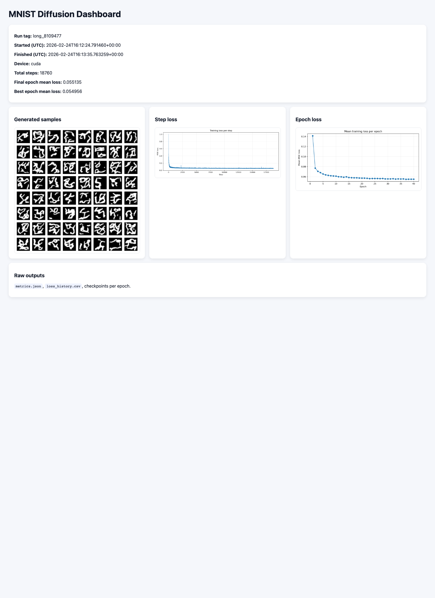

# PurdueHPC_Codex
Codex interface with Purdue HPCs

## MNIST diffusion experiment on Gautschi

Scratch working directory:

`/scratch/gautschi/rmaulik/codex_test`

Repo-managed scripts (mirror these into scratch):

- `mnist_diffusion.py`
- `submit_mnist_diffusion.slurm`
- `requirements.txt`

### One-time environment setup (on Gautschi)

```bash
mkdir -p /scratch/gautschi/rmaulik/codex_test
cd /scratch/gautschi/rmaulik/codex_test
python3 -m venv .venv
source .venv/bin/activate
python -m pip install --upgrade pip
python -m pip install -r requirements.txt
```

### Run interactively

```bash
cd /scratch/gautschi/rmaulik/codex_test
source .venv/bin/activate
python mnist_diffusion.py --epochs 5 --batch-size 128 --num-workers 8 --outdir outputs
```

### Submit with Slurm

```bash
cd /scratch/gautschi/rmaulik/codex_test
sbatch submit_mnist_diffusion.slurm
squeue -u rmaulik
```

Notes:
- The script targets partition `ai` and requests 1 GPU with 14 CPUs (required ratio on Gautschi AI partition).
- Generated images and checkpoints are written to `outputs/`.

### Tail of `slurm-8109439.out`

```text
epoch 5/5:  88%|████████▊ | 413/469 [00:01<00:00, 307.48it/s, loss=0.0650, step=2309]
epoch 5/5:  88%|████████▊ | 413/469 [00:01<00:00, 307.48it/s, loss=0.0648, step=2310]
epoch 5/5:  88%|████████▊ | 413/469 [00:01<00:00, 307.48it/s, loss=0.0543, step=2311]
epoch 5/5:  88%|████████▊ | 413/469 [00:01<00:00, 307.48it/s, loss=0.0700, step=2312]
epoch 5/5:  88%|████████▊ | 413/469 [00:01<00:00, 307.48it/s, loss=0.0629, step=2313]
epoch 5/5:  88%|████████▊ | 413/469 [00:01<00:00, 307.48it/s, loss=0.0676, step=2314]
epoch 5/5:  88%|████████▊ | 413/469 [00:01<00:00, 307.48it/s, loss=0.0718, step=2315]
epoch 5/5:  88%|████████▊ | 413/469 [00:01<00:00, 307.48it/s, loss=0.0808, step=2316]
epoch 5/5:  88%|████████▊ | 413/469 [00:01<00:00, 307.48it/s, loss=0.0607, step=2317]
epoch 5/5:  88%|████████▊ | 413/469 [00:01<00:00, 307.48it/s, loss=0.0693, step=2318]
epoch 5/5:  88%|████████▊ | 413/469 [00:01<00:00, 307.48it/s, loss=0.0748, step=2319]
epoch 5/5:  88%|████████▊ | 413/469 [00:01<00:00, 307.48it/s, loss=0.0740, step=2320]
epoch 5/5:  95%|█████████▍| 444/469 [00:01<00:00, 308.05it/s, loss=0.0740, step=2320]
epoch 5/5:  95%|█████████▍| 444/469 [00:01<00:00, 308.05it/s, loss=0.0697, step=2321]
epoch 5/5:  95%|█████████▍| 444/469 [00:01<00:00, 308.05it/s, loss=0.0718, step=2322]
epoch 5/5:  95%|█████████▍| 444/469 [00:01<00:00, 308.05it/s, loss=0.0586, step=2323]
epoch 5/5:  95%|█████████▍| 444/469 [00:01<00:00, 308.05it/s, loss=0.0644, step=2324]
epoch 5/5:  95%|█████████▍| 444/469 [00:01<00:00, 308.05it/s, loss=0.0713, step=2325]
epoch 5/5:  95%|█████████▍| 444/469 [00:01<00:00, 308.05it/s, loss=0.0660, step=2326]
epoch 5/5:  95%|█████████▍| 444/469 [00:01<00:00, 308.05it/s, loss=0.0660, step=2327]
epoch 5/5:  95%|█████████▍| 444/469 [00:01<00:00, 308.05it/s, loss=0.0831, step=2328]
epoch 5/5:  95%|█████████▍| 444/469 [00:01<00:00, 308.05it/s, loss=0.0683, step=2329]
epoch 5/5:  95%|█████████▍| 444/469 [00:01<00:00, 308.05it/s, loss=0.0683, step=2330]
epoch 5/5:  95%|█████████▍| 444/469 [00:01<00:00, 308.05it/s, loss=0.0645, step=2331]
epoch 5/5:  95%|█████████▍| 444/469 [00:01<00:00, 308.05it/s, loss=0.0763, step=2332]
epoch 5/5:  95%|█████████▍| 444/469 [00:01<00:00, 308.05it/s, loss=0.0630, step=2333]
epoch 5/5:  95%|█████████▍| 444/469 [00:01<00:00, 308.05it/s, loss=0.0624, step=2334]
epoch 5/5:  95%|█████████▍| 444/469 [00:01<00:00, 308.05it/s, loss=0.0630, step=2335]
epoch 5/5:  95%|█████████▍| 444/469 [00:01<00:00, 308.05it/s, loss=0.0815, step=2336]
epoch 5/5:  95%|█████████▍| 444/469 [00:01<00:00, 308.05it/s, loss=0.0648, step=2337]
epoch 5/5:  95%|█████████▍| 444/469 [00:01<00:00, 308.05it/s, loss=0.0661, step=2338]
epoch 5/5:  95%|█████████▍| 444/469 [00:01<00:00, 308.05it/s, loss=0.0625, step=2339]
epoch 5/5:  95%|█████████▍| 444/469 [00:01<00:00, 308.05it/s, loss=0.0666, step=2340]
epoch 5/5:  95%|█████████▍| 444/469 [00:01<00:00, 308.05it/s, loss=0.0614, step=2341]
epoch 5/5:  95%|█████████▍| 444/469 [00:01<00:00, 308.05it/s, loss=0.0761, step=2342]
epoch 5/5:  95%|█████████▍| 444/469 [00:01<00:00, 308.05it/s, loss=0.0659, step=2343]
epoch 5/5:  95%|█████████▍| 444/469 [00:01<00:00, 308.05it/s, loss=0.0669, step=2344]
epoch 5/5:  95%|█████████▍| 444/469 [00:01<00:00, 308.05it/s, loss=0.0595, step=2345]
epoch 5/5: 100%|██████████| 469/469 [00:01<00:00, 284.89it/s, loss=0.0595, step=2345]
Training complete on cuda. Saved samples to outputs/mnist_samples.png
```

## Longer run + dashboard

Submit a longer run:

```bash
cd /scratch/gautschi/rmaulik/codex_test
sbatch submit_mnist_diffusion_long.slurm
```

This writes a run folder under `outputs/<run_tag>/` with:

- `dashboard.html`
- `mnist_samples.png`
- `loss_curve_step.png`
- `loss_curve_epoch.png`
- `loss_history.csv`
- `metrics.json`

Serve the latest run on Gautschi:

```bash
cd /scratch/gautschi/rmaulik/codex_test
./serve_dashboard.sh
```

From your local machine, open an SSH tunnel and browse:

```bash
ssh -N -L 8080:localhost:8080 rmaulik@gautschi.rcac.purdue.edu
```

Then open:

`http://localhost:8080/dashboard.html`

### Dashboard preview


